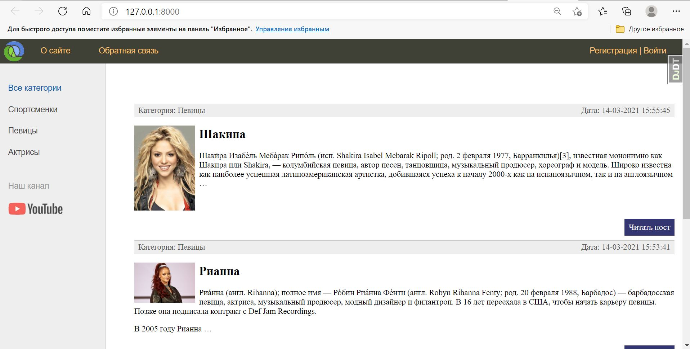

# Информационный сайт о знаминитых женщинах.

## Описание
Этот проект написан с целью отработки знаний, 
полученные в ходе прохождения курса Django-фреймворк.

На данный момент сайт выглядит вот так:


## Установка

```
pip instal -r requirements.txt
```

## Основные используемые библиотеки и фреймворки

* Django 3.1.7
* Более подробную информацию о других библиотеках
 и зависимостях можно найти в файле requirements.txt